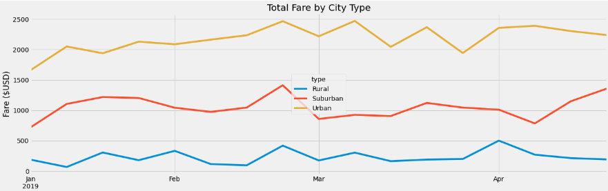

# PyBer_Analysis

## Overview
The purpose of this assignment was to creat a exploritory analysis for a ride-share firm.  The objective was to visualize our data through a series of charts and summary statistics to understand if relationships exist between city types, driver count, revenue and other variables. 

## Results
- **Ride Volume**
  - From the summary data table, town/city ride volume increases the closer you are to urban centers.  This makes sense when considering the changes in population    density across these city types.  It also may be influced by the average distance of the ride. 
- **Driver Count**
  - We see the same pattern in driver counts accross these city types.  Most likely this is also a factor of population density.  However, we could explore this further as an oppertunity for market share growth in rural communities.  
- **Total Revenue (Fares)**
  - A similar patern in the summary table is observed for total revenue across city types.
- **Average Fare per Driver and Ride**
  - Fairs per driver and ride follow an opposite pattern, where average rural fairs are much higher for these two buckets.  This could be explained either through supply and demand or average ride distance.  With less availibility, a company could increase fairs or rural trips may just be longer generating hier revenu.  Lastly rates per driver are also higher due to lack of drivers in that area.
- **Line Chart**
  - It is worth mentioning that when looking at the trend in total revenue, suburban fairs have increased +50% (~1500 vs ~1000) in the month of April.      

## Summary
Based on this limited data set, my three recommendations are:
1. There may be potential to charge a premium on short rides in urban centers, thus increasing their revenue and subsequently margin.
2. There may be potential to increase driver counts in rual areas to increase overall market-share.  These markets may be easier to gain ground against competitors. 
3. While rural and urban centers present interesting findings, the recent revenue increase in suburban centers presents the immeadiate oppertunity to drive marketing promotions and asales in that area.   
